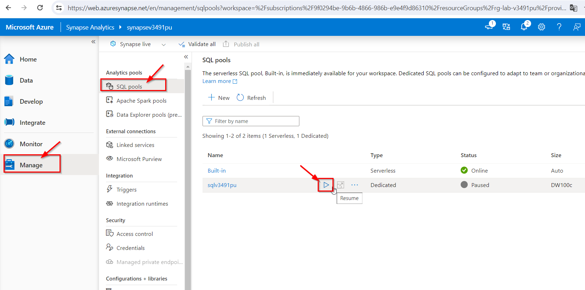
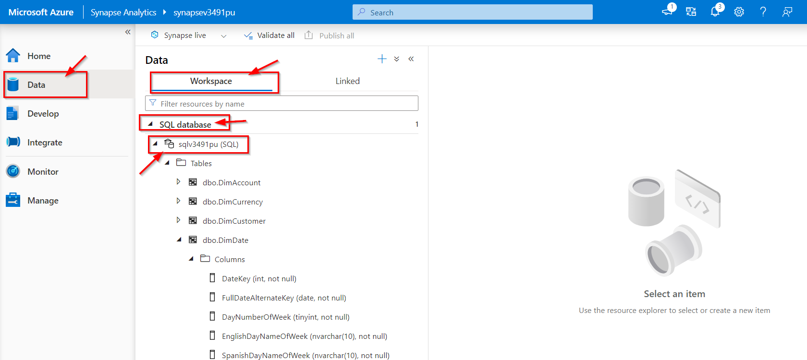
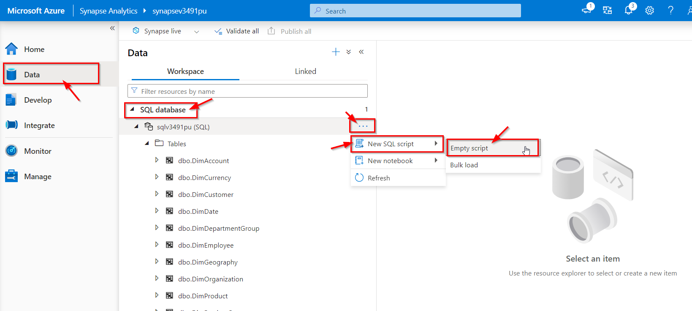

# Explora un almacén de datos relacional

## Prerequisitos
Necesitará una [Azure subscription](https://azure.microsoft.com/free) a la que tenga acceso de nivel administrativo.

## Aprovisionar un área de trabajo de Azure Synapse Analytics

*Un área de trabajo* de Azure Synapse Analytics proporciona un punto central para administrar datos y tiempos de ejecución de procesamiento de datos. Puede aprovisionar un área de trabajo mediante la interfaz interactiva en Azure Portal o puede implementar un área de trabajo y recursos dentro de ella mediante un script o una plantilla. En la mayoría de los escenarios de producción, es mejor automatizar el aprovisionamiento con scripts y plantillas para poder incorporar la implementación de recursos en un proceso de desarrollo y operaciones (DevOps) repetible.

En este ejercicio, utilizará una combinación de un script de PowerShell y una plantilla de ARM para aprovisionar Azure Synapse Analytics.

1. Inicie sesión en Azure Portal en https://portal.azure.com.

2. Utilice el botón **[>_]** a la derecha de la barra de búsqueda en la parte superior de la página para crear un nuevo Cloud Shell en Azure Portal, seleccionando un entorno de **PowerShell** y creando almacenamiento si se le solicita. Cloud Shell proporciona una interfaz de línea de comandos en un panel en la parte inferior de Azure Portal, como se muestra aquí:

  

> **Nota** : si anteriormente creó un shell de nube que usa un entorno Bash , use el menú desplegable en la parte superior izquierda del panel de shell de nube para cambiarlo a PowerShell.

3. Tenga en cuenta que puede cambiar el tamaño del shell de la nube arrastrando la barra separadora en la parte superior del panel o usando los íconos — , ◻ y X en la parte superior derecha del panel para minimizar, maximizar y cerrar el panel. Para obtener más información sobre el uso de Azure Cloud Shell, consulte la [documentación de Azure Cloud Shell](https://docs.microsoft.com/azure/cloud-shell/overview)..
   
4. En el panel de PowerShell, ingrese los siguientes comandos para clonar este repositorio:

```
rm -r laboratorio -f
git clone https://github.com/luiscardpuan/Azure-Data.git laboratorio
```

5. Una vez clonado el repositorio, ingrese los siguientes comandos para cambiar a la carpeta de esta práctica de laboratorio y ejecutar el script setup.ps1 que contiene:

  ```
  cd laboratorio/labs/03-Explorar-data-warehouse
  ./setup.ps1
  ```
6. Si se le solicita, elija qué suscripción desea usar (esto solo sucederá si tiene acceso a varias suscripciones de Azure).

7. Cuando se le solicite, ingrese una contraseña adecuada que se establecerá para su grupo de SQL de Azure Synapse.

> **Nota** : ¡Asegúrese de recordar esta contraseña!

Espere a que se complete el script; esto suele tardar unos 15 minutos, pero en algunos casos puede tardar más.

## Explora el esquema del almacén de datos

En esta práctica de laboratorio, el almacén de datos se hospeda en un grupo de SQL dedicado en Azure Synapse Analytics.

### Inicie el grupo SQL dedicado
1. Una vez completado el script, en Azure Portal, vaya al grupo de recursos **rg-lab-xxxxxxx** que creó y seleccione su área de trabajo de Synapse.
2. En la página Descripción general de su espacio de trabajo de Synapse, en la tarjeta Abrir Synapse Studio , seleccione Abrir para abrir Synapse Studio en una nueva pestaña del navegador; iniciar sesión si se le solicita.
3. En el lado izquierdo de Synapse Studio, use el ícono **&rsaquo;&rsaquo;** para expandir el menú; esto revela las diferentes páginas dentro de Synapse Studio que se utilizan para administrar recursos y realizar tareas de análisis de datos.
4. En la página **Manage** , asegúrese de que la pestaña **SQL pools** esté seleccionada y luego seleccione el grupo de SQL dedicado **sqlxxxxxxx** y use su ícono **&#9655;** para iniciarlo; confirmando que desea reanudarlo cuando se le solicite.
5. Espere a que se reanude el grupo de SQL. Esto puede tardar unos minutos. Utilice el botón **&#8635;** Actualizar para comprobar su estado periódicamente. El estado se mostrará como En línea cuando esté listo.




### Ver las tablas en la base de datos.

1.	En Synapse Studio, seleccione la página **Data** y asegúrese de que la pestaña **Workspace** esté seleccionada y contenga una categoría **SQL database**.

2.	Expanda **SQL database**, el grupo **sqlxxxxxxx** y su carpeta **Tables** para ver las tablas en la base de datos.

  	Un almacén de datos relacional normalmente se basa en un esquema que consta de tablas de hechos y dimensiones . Las tablas están optimizadas para consultas analíticas en las que las métricas numéricas de las tablas de hechos se agregan mediante atributos de las entidades representadas por las tablas de dimensiones; por ejemplo, le permiten agregar los ingresos por ventas de Internet por producto, cliente, fecha, etc.

3.	Expanda la tabla **dbo.FactInternetSales** y su carpeta **Columnas** para ver las columnas de esta tabla. Tenga en cuenta que muchas de las columnas son claves que hacen referencia a filas en las tablas de dimensiones. Otros son valores numéricos ( medidas ) para análisis.

	Las claves se utilizan para relacionar una tabla de hechos con una o más tablas de dimensiones, a menudo en un esquema de estrella ; en el que la tabla de hechos está directamente relacionada con cada tabla de dimensiones (formando una "estrella" de múltiples puntas con la tabla de hechos en el centro).

4.	Vea las columnas de la tabla **dbo.DimPromotion** y tenga en cuenta que tiene una **PromotionKey** única que identifica de forma única cada fila de la tabla. También tiene una **clave alternativa**.

	Por lo general, los datos de un almacén de datos se importan de una o más fuentes transaccionales. La clave alternativa refleja el identificador de negocio para la instancia de esta entidad en el origen, pero generalmente se genera una clave sustituta numérica única para identificar de forma única cada fila en la tabla de dimensiones del almacén de datos. Uno de los beneficios de este enfoque es que permite que el almacén de datos contenga múltiples instancias de la misma entidad en diferentes momentos (por ejemplo, registros del mismo cliente que reflejan su dirección en el momento en que se realizó un pedido).

5.	Vea las columnas de **dbo.DimProduct** y tenga en cuenta que contiene una columna **ProductSubcategoryKey**, que hace referencia a la tabla **dbo.DimProductSubcategory**, que a su vez contiene una columna **ProductCategoryKey** que hace referencia a la tabla **dbo.DimProductCategory**.

	En algunos casos, las dimensiones están parcialmente normalizadas en varias tablas relacionadas para permitir diferentes niveles de granularidad, como productos que se pueden agrupar en subcategorías y categorías. Esto da como resultado que una simple estrella se extienda a un esquema de copo de nieve , en el que la tabla de hechos central está relacionada con una tabla de dimensiones, que a su vez está relacionada con otras tablas de dimensiones.

6.	Vea las columnas de la tabla **dbo.DimDate** y tenga en cuenta que contiene varias columnas que reflejan diferentes atributos temporales de una fecha, incluidos el día de la semana, el día del mes, el mes, el año, el nombre del día, el nombre del mes, etc.
Las dimensiones de tiempo en un almacén de datos generalmente se implementan como una tabla de dimensiones que contiene una fila para cada una de las unidades temporales de granularidad más pequeñas (a menudo denominadas grano de la dimensión) mediante las cuales se desean agregar las medidas en las tablas de hechos. En este caso, el grano más bajo en el que se pueden agregar medidas es una fecha individual y la tabla contiene una fila para cada fecha desde la primera hasta la última fecha a la que se hace referencia en los datos. Los atributos de la tabla **DimDate** permiten a los analistas agregar medidas basadas en cualquier clave de fecha en la tabla de hechos, utilizando un conjunto consistente de atributos temporales (por ejemplo, ver pedidos por mes según la fecha del pedido). La tabla **FactInternetSales** contiene tres claves relacionadas con la tabla **DimDate : OrderDateKey , DueDateKey y ShipDateKey**.



## Consultar las tablas del almacén de datos.

Ahora que ha explorado algunos de los aspectos más importantes del esquema del almacén de datos, está listo para consultar las tablas y recuperar algunos datos.

### Consultar tablas de hechos y dimensiones.

Los valores numéricos en un almacén de datos relacional se almacenan en tablas de hechos con tablas de dimensiones relacionadas que puede utilizar para agregar los datos en múltiples atributos. Este diseño significa que la mayoría de las consultas en un almacén de datos relacional implican agregar y agrupar datos (usando funciones agregadas y cláusulas GROUP BY) en tablas relacionadas (usando cláusulas JOIN).

1. En la página **Data** , seleccione SQL database **sqlxxxxxxx** y en su menú **...** , seleccione **New SQL script > Emty Script**.

	

2. Cuando se abra una nueva pestaña **SQL Script 1**, en su panel **Properties**, cambie el nombre del script a **Analizar ventas de Internet** y cambie la configuración de Resultados por consulta para devolver todas las filas. Luego use el botón **Publish all**Publicar en la barra de herramientas para guardar el script y use el botón Propiedades (que se parece a **&#128463;.** ) en el extremo derecho de la barra de herramientas para cerrar el panel Propiedades para que pueda ver el panel del script.

3. En el script vacío, agregue el siguiente código:

```sql
SELECT  d.CalendarYear AS Year,
        SUM(i.SalesAmount) AS InternetSalesAmount
FROM FactInternetSales AS i
JOIN DimDate AS d ON i.OrderDateKey = d.DateKey
GROUP BY d.CalendarYear
ORDER BY Year;
```

4. Utilice el botón **▷** Ejecutar para ejecutar el script y revisar los resultados, que deberían mostrar los totales de ventas de Internet para cada año. Esta consulta une la tabla de hechos para las ventas por Internet a una tabla de dimensiones de tiempo basada en la fecha del pedido y agrega la medida del monto de ventas en la tabla de hechos por el atributo de mes calendario de la tabla de dimensiones.

5. Modifique la consulta de la siguiente manera para agregar el atributo de mes de la dimensión de tiempo y luego ejecute la consulta modificada.

```sql
SELECT  d.CalendarYear AS Year,
      d.MonthNumberOfYear AS Month,
      SUM(i.SalesAmount) AS InternetSalesAmount
FROM FactInternetSales AS i
JOIN DimDate AS d ON i.OrderDateKey = d.DateKey
GROUP BY d.CalendarYear, d.MonthNumberOfYear
ORDER BY Year, Month;
```


