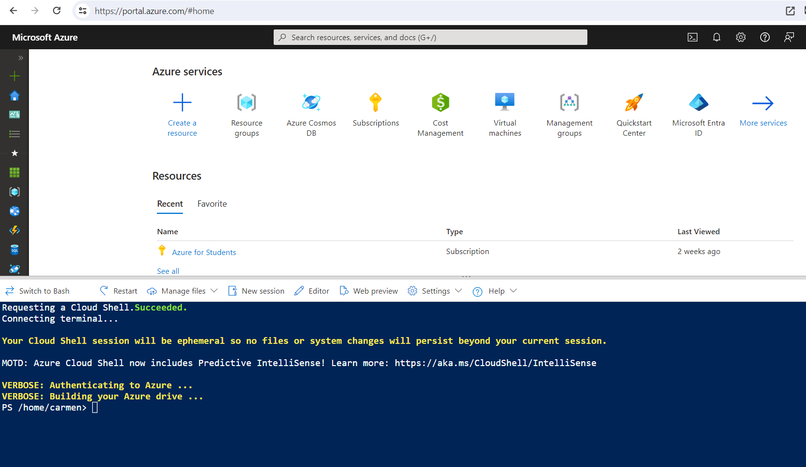

# Explora un almacén de datos relacional

## Prerequisitos
Necesitará una [Azure subscription](https://azure.microsoft.com/free) a la que tenga acceso de nivel administrativo.

## Aprovisionar un área de trabajo de Azure Synapse Analytics

*Un área de trabajo* de Azure Synapse Analytics proporciona un punto central para administrar datos y tiempos de ejecución de procesamiento de datos. Puede aprovisionar un área de trabajo mediante la interfaz interactiva en Azure Portal o puede implementar un área de trabajo y recursos dentro de ella mediante un script o una plantilla. En la mayoría de los escenarios de producción, es mejor automatizar el aprovisionamiento con scripts y plantillas para poder incorporar la implementación de recursos en un proceso de desarrollo y operaciones (DevOps) repetible.

En este ejercicio, utilizará una combinación de un script de PowerShell y una plantilla de ARM para aprovisionar Azure Synapse Analytics.

1. Inicie sesión en Azure Portal en https://portal.azure.com.

2. Utilice el botón **[>_]** a la derecha de la barra de búsqueda en la parte superior de la página para crear un nuevo Cloud Shell en Azure Portal, seleccionando un entorno de **PowerShell** y creando almacenamiento si se le solicita. Cloud Shell proporciona una interfaz de línea de comandos en un panel en la parte inferior de Azure Portal, como se muestra aquí:

  

> **Nota** : si anteriormente creó un shell de nube que usa un entorno Bash , use el menú desplegable en la parte superior izquierda del panel de shell de nube para cambiarlo a PowerShell.

3. Tenga en cuenta que puede cambiar el tamaño del shell de la nube arrastrando la barra separadora en la parte superior del panel o usando los íconos — , ◻ y X en la parte superior derecha del panel para minimizar, maximizar y cerrar el panel. Para obtener más información sobre el uso de Azure Cloud Shell, consulte la [documentación de Azure Cloud Shell](https://docs.microsoft.com/azure/cloud-shell/overview)..
   
4. En el panel de PowerShell, ingrese los siguientes comandos para clonar este repositorio:

```
rm -r laboratorio -f
git clone https://github.com/luiscardpuan/Azure-Data.git laboratorio
```

5. Una vez clonado el repositorio, ingrese los siguientes comandos para cambiar a la carpeta de esta práctica de laboratorio y ejecutar el script setup.ps1 que contiene:

  ```
  cd laboratorio/labs/03-Explorar-data-warehouse
  ./setup.ps1
  ```
  
